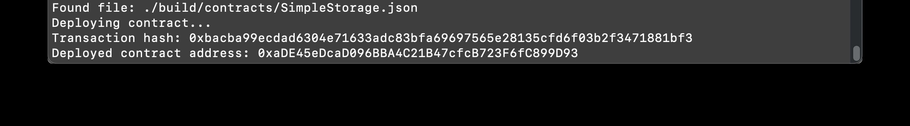

# task 2

1. A screenshot of the console output immediately after you have successfully deployed a smart contract.

	

2. The transaction hash from the contract deployment (in text format).

	0xbacba99ecdad6304e71633adc83bfa69697565e28135cfd6f03b2f3471881bf3

3. The deployed contract address from the contract deployment (in text format).

	0xaDE45eDcaD096BBA4C21B47cfcB723F6fC899D93