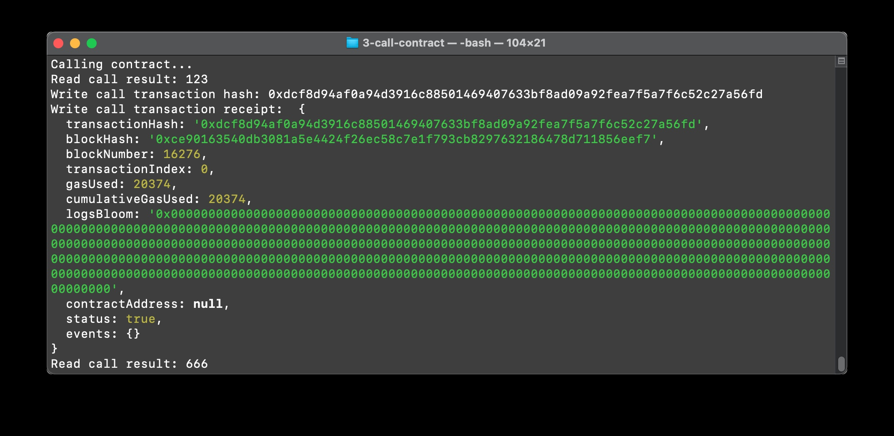

# task 3

1. A screenshot of the console output immediately after you have successfully issued a smart contract call.

	


2. The transaction hash from the console output (in text format).

	0xdcf8d94af0a94d3916c88501469407633bf8ad09a92fea7f5a7f6c52c27a56fd


3. The contract address that you called (in text format).

	0xaDE45eDcaD096BBA4C21B47cfcB723F6fC899D93


4. The ABI for contract you made a call on (in text format).

	```
  	"abi": [
    {
      "inputs": [],
      "stateMutability": "payable",
      "type": "constructor"
    },
    {
      "inputs": [
        {
          "internalType": "uint256",
          "name": "x",
          "type": "uint256"
        }
      ],
      "name": "set",
      "outputs": [],
      "stateMutability": "payable",
      "type": "function"
    },
    {
      "inputs": [],
      "name": "get",
      "outputs": [
        {
          "internalType": "uint256",
          "name": "",
          "type": "uint256"
        }
      ],
      "stateMutability": "view",
      "type": "function"
    }
  ]
  ```