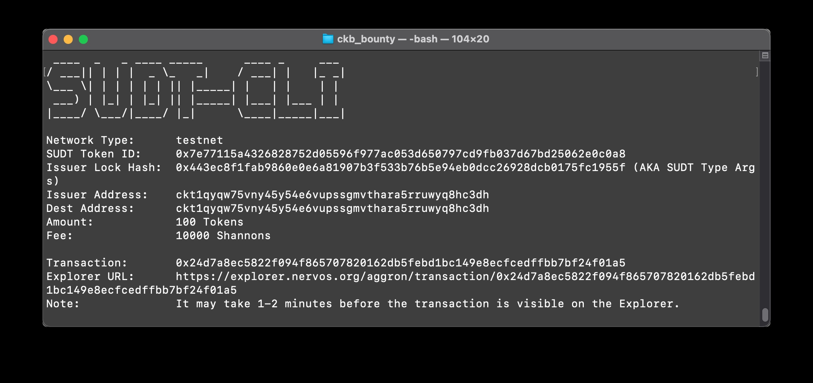
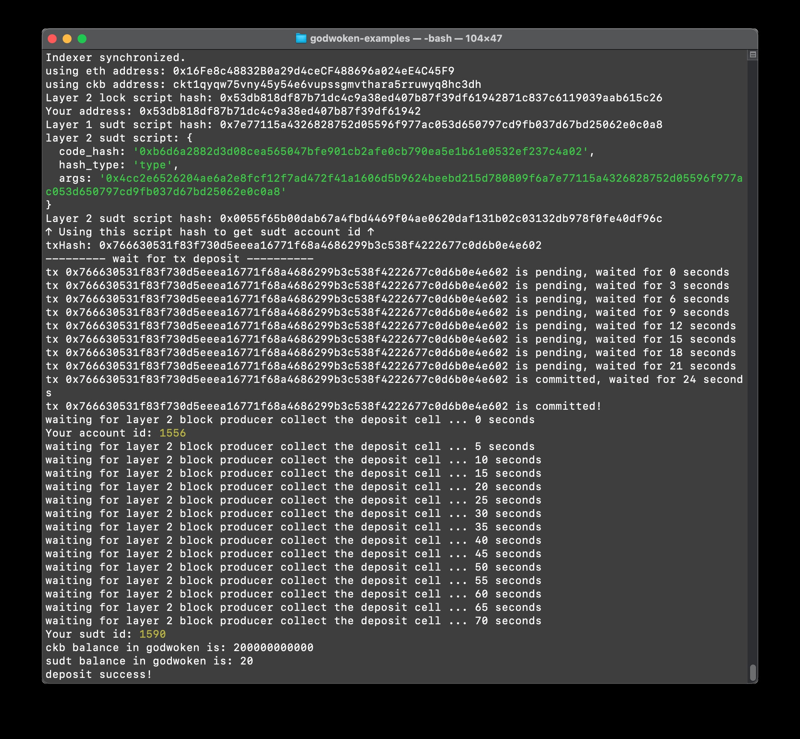

# task 4

1. A link to the Layer 1 address you funded on the Testnet Explorer.

	https://explorer.nervos.org/aggron/address/ckt1qyqw75vny45y54e6vupssgmvthara5rruwyq8hc3dh

2. A screenshot of the console output immediately after using sudt-cli to create your SUDT tokens on Layer 1.

	

3. A link to the transaction ID created by sudt-cli on the Testnet Explorer.

 	https://explorer.nervos.org/aggron/transaction/0x24d7a8ec5822f094f865707820162db5febd1bc149e8ecfcedffbb7bf24f01a5

4. A screenshot of the console output immediately after you have successfully submitted a deposit to Layer 2 using the account-cli tool.

	

5. The SUDT ID from the console output after executing the deposit script (in text format).

	sudt id: 1590

	
