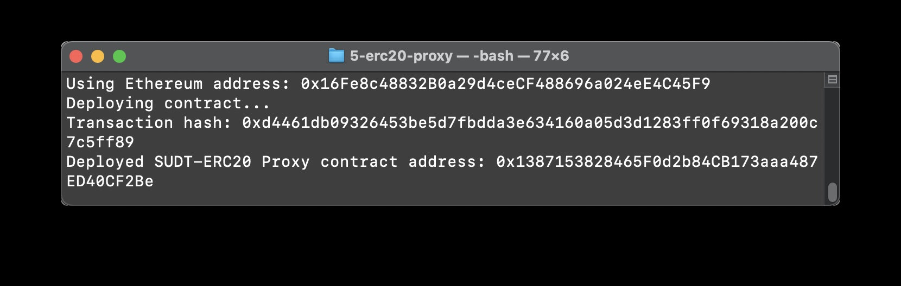
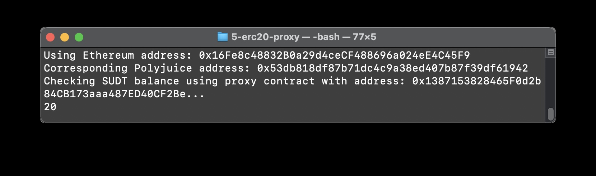

# task 5

1. A screenshot of the console output immediately after deploying smart contract.

	

2. The address of the ERC20 Proxy Contract you deployed (in text format).

	0x1387153828465F0d2b84CB173aaa487ED40CF2Be

3. A screenshot of the console output immediately after checking your SUDT balance.
	
	

4. The Ethereum address that was checked (in text format).

	0x16Fe8c48832B0a29d4ceCF488696a024eE4C45F9

	

