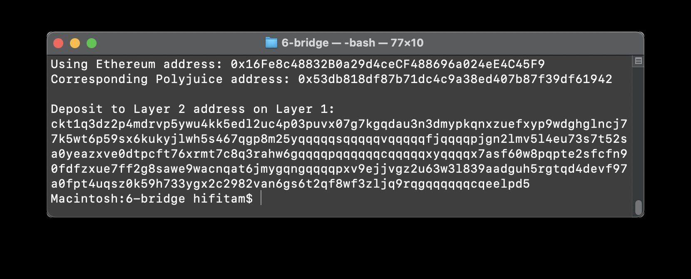

# task 6

1. A screenshot of the console output immediately after you have successfully generated your Deposit Receiver Address.

	

2. Your Deposit Receiver Address (in text format).

	ckt1q3dz2p4mdrvp5ywu4kk5edl2uc4p03puvx07g7kgqdau3n3dmypkqnxzuefxyp9wdghglncj77k5wt6p59sx6kukyjlwh5s467qgp8m25yqqqqqsqqqqqvqqqqqfjqqqqpjgn2lmv5l4eu73s7t52sa0yeazxve0dtpcft76xrmt7c8q3rahw6gqqqqpqqqqqqcqqqqqxyqqqqx7asf60w8pqpte2sfcfn90fdfzxue7ff2g8sawe9wacnqat6jmygqngqqqqpxv9ejjvgz2u63w3l839aadguh5rgtqd4devf97a0fpt4uqsz0k59h733ygx2c2982van6gs6t2qf8wf3zljq9rqgqqqqqqcqeelpd5

3. The Ethereum address used to generate the Deposit Receiver Address (in text format).

	0x16Fe8c48832B0a29d4ceCF488696a024eE4C45F9

4. A link to the Etherscan explorer for the successful Force Bridge transaction. This can be found on Force Bridge under History→Succeed.

	https://rinkeby.etherscan.io/tx/0x5ed6f3bc27927aab8f34ddce9902bf0a490f7dfa147c1d218a71c47c3cf825d9

5. A link to the Nervos explorer for the successful Force bridge transaction. This can be found on Force Bridge under History→Succeed.

	https://explorer.nervos.org/aggron/transaction/0xfc72c4db38b74f425bcf6bfda2e26f068978e009a098816bb2ca06808dfcd259

	