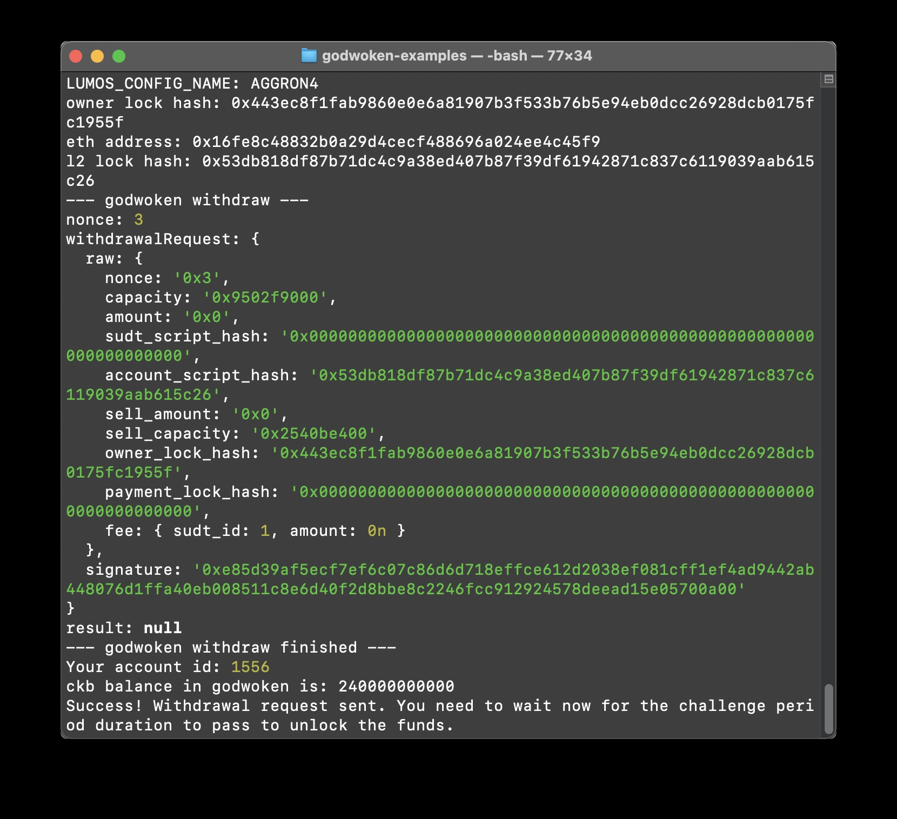

# task 9

1. A screenshot of the console output immediately after running the withdraw command.
	
	

2. The Ethereum address that you've used for your Layer 2 account (in text format).

	0x16fe8c48832b0a29d4cecf488696a024ee4c45f9

3. The Nervos Layer 1 address that you passed to withdraw command (in text format).

	ckt1qyqw75vny45y54e6vupssgmvthara5rruwyq8hc3dh